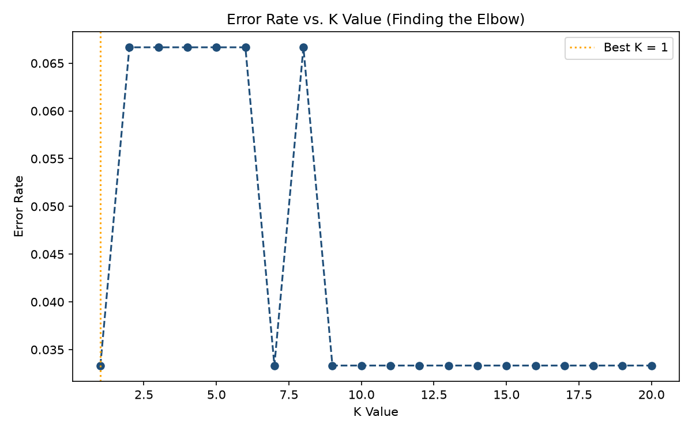
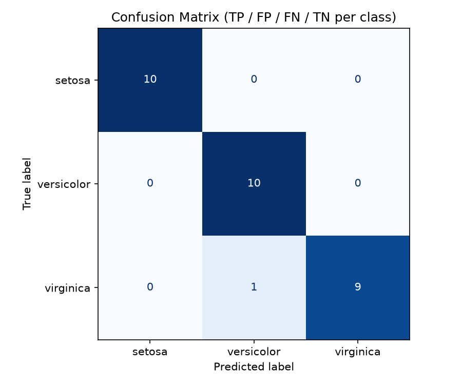

# 🌸 Iris Flower Classification using KNN

A supervised machine learning project that classifies Iris flowers into three species — **Setosa**, **Versicolor**, and **Virginica** — based on their physical measurements (sepal length, sepal width, petal length, petal width).

Built as **Project 2** of the DecodeLabs AI Industrial Training Kit (Batch 2026).

---

## 📌 What Does It Do?

This project trains a **K-Nearest Neighbors (KNN)** classifier to predict the species of an Iris flower using only 4 numerical measurements. It follows a complete supervised learning pipeline:

1. Loads and explores the classic Iris dataset (150 samples, 3 balanced classes)
2. Splits the data into training (80%) and testing (20%) sets
3. Scales features using `StandardScaler` for fair distance-based comparison
4. Automatically finds the best value of **K** by testing K = 1 to 20
5. Trains the KNN model and generates predictions on unseen test data
6. Evaluates performance using Accuracy, F1-Score, and a Confusion Matrix
7. Demonstrates predicting the species of a brand-new, unseen flower

**Result:** ~97% accuracy on the test set.

---

## 🛠️ Tech Stack

- Python 3
- scikit-learn
- pandas
- numpy
- matplotlib / seaborn

---

## 🚀 How to Run

**1. Clone or download this repository**

**2. Install the required libraries**
```bash
pip install scikit-learn pandas matplotlib seaborn
```

**3. Run the script**
```bash
python project2_iris_classification.py
```

**4. Check the output**
- Terminal will print dataset info, accuracy, F1-score, and classification report
- Two plots will be generated in the project folder:
  - `k_selection_plot.png` — shows how error rate changes with K
  - `confusion_matrix.png` — visualizes correct vs incorrect predictions

---

## 📊 Sample Output

```
Accuracy : 96.67%
F1 Score : 0.967

Predicted species for a new flower [5.1, 3.5, 1.4, 0.2]: SETOSA
```

**Choosing the optimal K:**



**Confusion Matrix (model evaluation):**



---

## 📁 Project Structure

```
├── project2_iris_classification.py   # Main script
├── k_selection_plot.png              # Generated: K-value tuning graph
├── confusion_matrix.png              # Generated: Model evaluation chart
└── README.md                         # You are here
```

---

## 🎯 Key Concepts Demonstrated

- Supervised learning & classification
- Train/test split with stratification
- Feature scaling and why it matters for distance-based algorithms
- Hyperparameter tuning (choosing optimal K)
- Model evaluation beyond accuracy (Precision, Recall, F1-score, Confusion Matrix)

---

*Built as part of the DecodeLabs AI Engineering Training Program.*
